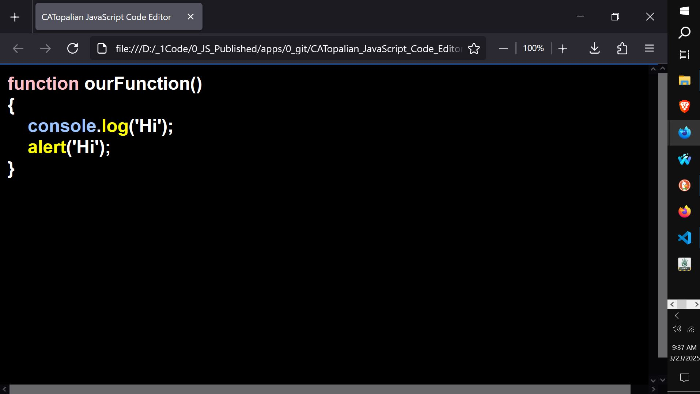

# CATopalian JavaScript Code Editor
A JavaScript Code Editor that colors the text of the JavaScript language as we type, for coding projects.  

USE APP: https://christopherandrewtopalian.github.io/CATopalian_JavaScript_Code_Editor/CATopalian_JavaScript_Code_Editor.html  

  

---

CODE: https://github.com/ChristopherAndrewTopalian/CATopalian_JavaScript_Code_Editor

---

### How to Download this App
1. Click the green Code Button on this github page
2. Choose Download ZIP
3. Save the Zip File
4. Extract All
5. Double click the HTML file to start the App

---

Happy Scripting :-)

---

//----//

// Dedicated to God the Father  
// All Rights Reserved Christopher Andrew Topalian Copyright 2000-2025  
// https://github.com/ChristopherTopalian  
// https://github.com/ChristopherAndrewTopalian  
// https://sites.google.com/view/CollegeOfScripting

